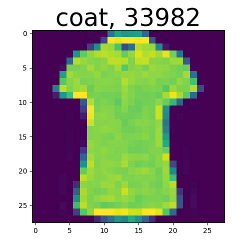
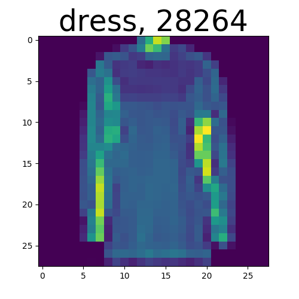
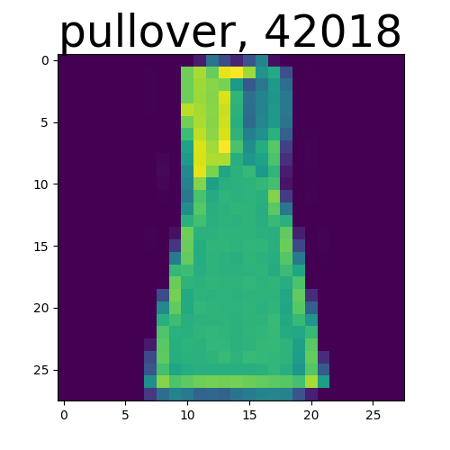
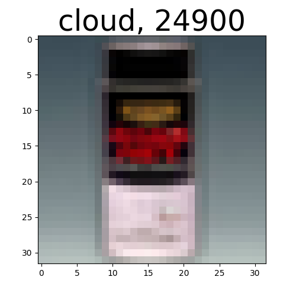
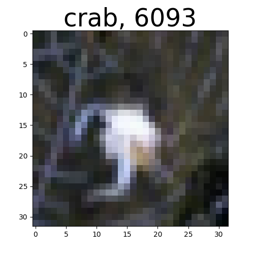
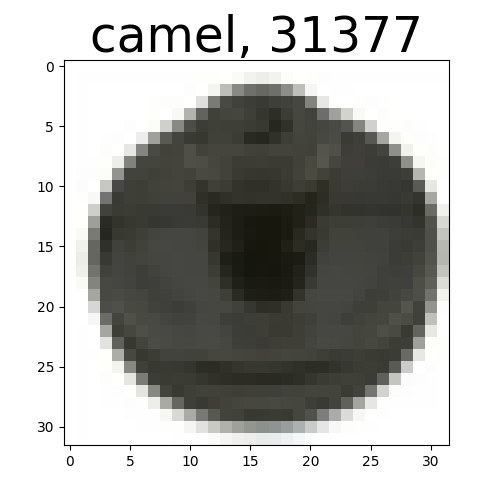
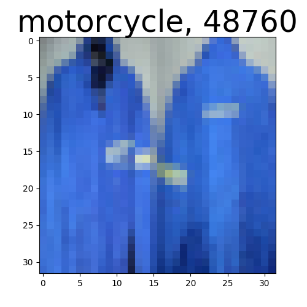
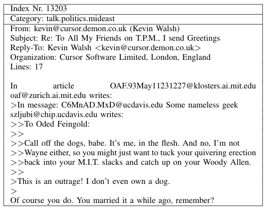
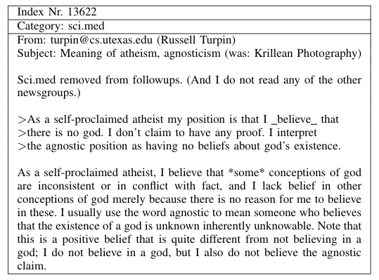
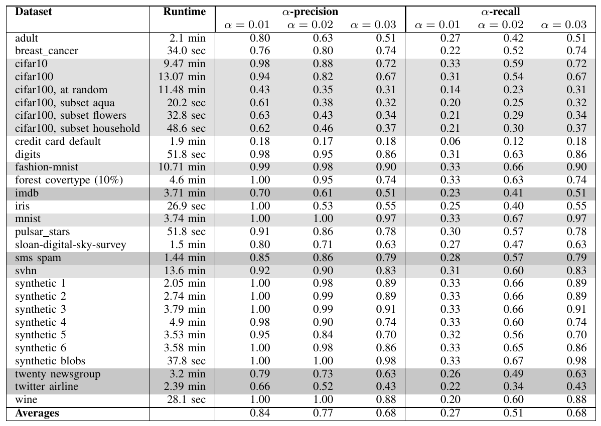

# LabelFix - Identifying Mislabeled Instances in Classification Data Sets

Welcome to the LabelFix project.
The goal of this tool is to find mislabeled data instances in image, text and numerical data in order to speed up the manual reviewing process by domain experts.

This work has been published at IJCNN 2019. The article can be found at
https://ieeexplore.ieee.org/document/8851920
and at ArXiv.org: https://arxiv.org/pdf/1912.05283.pdf

## Installation

Note: It is advisable to use a virtual environment for installing and running the code.

This tool has been developed using Python 3.
Run `pip3 install -r requirements.txt` to install the required Python3 dependencies.
This will install the dependencies for CPU. If you want to run the code on a machine with GPU support you have to follow
https://www.tensorflow.org/install/gpu in order to install the GPu-compatible version of Tensorflow. 

## Usage

### Execution of 'quantitative evaluation'
To run the quantitative evaluation of the system run `src/quantitative_evaluation.py` from the main directory `labelfix`.
You may need to set your environment variables:

`PYTHONPATH=.:$PYTHONPATH python3 src/quantitative_evaluation.py`

### Working examples
To find mislabeled instances, e.g., in the fashion MNIST data set, run the following.

`PYTHONPATH=.:$PYTHONPATH python3 src/examples/find_in_fashion_mnist.py`

Since the code includes random numbers, different runs will lead to a possibly different outcome.

To find mislabeled instances in your own data, follow the examples in `src/examples`.

### Paper data sets

Most data sets used in the paper will be automatically downloaded and stored in the `res/` directory.
The exception is the SDSS data set (https://www.kaggle.com/lucidlenn/sloan-digital-sky-survey) and the Twitter Airline
data set (https://www.kaggle.com/crowdflower/twitter-airline-sentiment). Both have to be downloaded from Kaggle manually
and stored as `res/kaggle/Skyserver_SQL2_27_2018 6_51_39 PM.csv` and `res/kaggle/Tweets.csv` respectively.
For the download you are required to have an account at Kaggle.

### Custom data
To load a custom data set, you need to pre-process it and supply it as a dictionary `{"data": X, "target": y}`.
The following code gives an example:

```python
# First, construct required dictionary using the fashion mnist training data
(x_train, y_train), (_, _) = tf.keras.datasets.fashion_mnist.load_data()
dataset = {'data': x_train, 'target': y_train}

# check the data set
res = check_dataset(dataset)

# plot four sets of images with the most likely mislabeled pairs (x, y) and save to disk
for i in range(4):
    visualize_image(image_data=dataset["data"],
                    image_labels=dataset["target"],
                    label_names=["top/shirt", "trousers", "pullover", "dress", "coat", "sandal", "shirt", "sneaker", "bag", "ankle boot"],
                    indices=res["indices"],
                    batch_to_plot=i,
                    save_to_path="/tmp/found_fashion_mnist/")
```

The algorithm's output is shown in the following.
It displays the top 9 images the algorithm return, e.g., the nine images
out of the MNIST training data set that are the most likely to be mislabeled.
Upon close inspection, it is clear that they are indeed all labeled with
questionable labels.



Remember that the code includes some randomization, so different runs do not necessarily lead to the same image.


## Results
Below are some results of our system on the publically available and famous data sets
Fashion MNIST and Cifar-100.

#### Mislabeled instances from the fashion MNIST training set





#### Mislabeled instances from the Cifar-100 training set





#### 20 Newsgroup
Below two examples from the twenty newsgroup where the content does not match the label.





#### Quantitative Evaluation Results
Table 3 from the Paper:



## Copyright
GPLv2, see the files `LICENSE` and `GPLv2`.

## Bugs and Contribution
Please let us know if you find bugs and/or would like to contribute.

